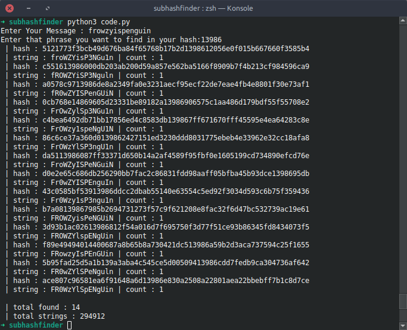

# subhashfinder

It's a project for finding specific phrases in hexdigest of SHA256 hash.

**like this example : **

you try an string and script count all of strings wich look like yours.

for exmaple if I enter "*frowzy*" as input it would suggest me a list of strings like below : 
* FroWzy 
* fRowZY 
* fr0WzY

and a bunch of strings like first input 

next step is counting string hashs (**SHA256** supported) and looking for our phrase inside their hexdigest 

in python I've used : `hashlib.sha256(string.encode()).hexdigest.count(phrase)>0 ` 

it would have some issues that I hope tobe fixed ASAP.
